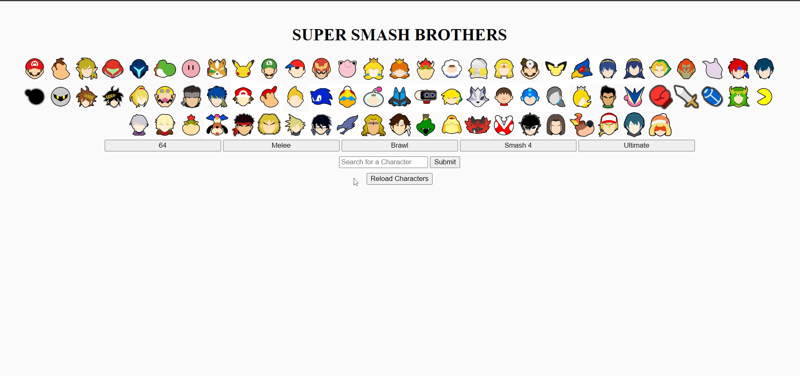

# Super Smash Brothers API Filter
### Welcome to the Super Smash Brothers character list. This page obtains a list of the different characters from the game series Super Smash Brothers and displays their icons in a grid.  

* A user can select any character’s icon to display more information about that character, including a character portrait, a list of which smash titles the character appeared in, and the character’s game franchise/logo.  

* If you would like to filter by invidual game, click on the buttons labeled with the different smash bros iterations.  For example, clicking on "64" will show only the playable characters from Super Smash Brothers for the Nintendo 64.

* There is also a search field if you are interested in highlighting a specific character in the icon display.  The name of the character must match exactly or the page will not yield any results.

* As characters are selected, they will remain highlighted so you can keep track of which characters you have explored.  A second click will remove the highlight.

* If at any point you would like to reset the display back to the full character selection, without any additional highlights, simply click the "reload characters" button.

I hope you enjoy exploring the many characters that have appeared in Super Smash Brothers games since 1999!

## Demonstration

## Installation

 
Because of the “Access-Control-Allow-Origin” error, the Moesif Origin & CORS Changer chrome extension is currently used to complete fetch requests from the API, obtainable here: https://chrome.google.com/webstore/detail/moesif-origin-cors-change/digfbfaphojjndkpccljibejjbppifbc?hl=en-US

 

## Authors and Acknowledgement

This unofficial API for Super Smash Brothers was created by Leonardo Cabeza at https://github.com/leocabeza
The Location of the utilized API is https://smashbros-unofficial-api.vercel.app/

 